# Vendor Reliability Intelligence Platform Database Architecture

## 1. Business Requirement Analysis
The platform supports enterprise vendor lifecycle management: secure internal users, RBAC authorization, vendor onboarding, contacts, addresses, document governance, KPI tracking, reliability scoring, risk assessment, compliance monitoring, procurement requests, quotations, purchase orders, contract lifecycle management, communications, notifications, reports, and dashboard metrics.

The database is designed for thousands of vendors and many internal users. It preserves operational history, supports auditability, enables reporting, and keeps document binaries out of PostgreSQL by storing only metadata and object-storage references.

## 2. Database Design Decisions
- All primary keys use UUIDs with `gen_random_uuid()` from `pgcrypto`.
- Business entities use `created_at`, `updated_at`, and `deleted_at` for soft deletion.
- Append-only records such as login history and audit logs do not use soft deletion.
- Many-to-many relationships use junction tables with composite primary keys and unique constraints.
- Historical references to users use `ON DELETE SET NULL`; dependent child records use `ON DELETE CASCADE`.
- Scores, weights, quantities, money values, currencies, and date ranges are protected with CHECK constraints.
- PostgreSQL enums are used for stable state machines.
- JSONB is limited to flexible report definitions, audit snapshots, notification payloads, and dashboard configuration.

## 3. Complete Entity List
Authentication: `users`, `roles`, `permissions`, `user_roles`, `role_permissions`, `login_history`, `audit_logs`.

Vendor management: `vendor_categories`, `vendors`, `vendor_contacts`, `vendor_addresses`, `vendor_documents`.

Vendor performance: `performance_metrics`, `vendor_reliability_scores`, `vendor_kpi_history`.

Risk management: `risk_factors`, `risk_assessments`, `risk_assessment_factors`, `vendor_compliance_status`.

Procurement: `procurement_requests`, `procurement_items`, `vendor_quotations`, `vendor_quotation_items`, `purchase_orders`, `purchase_order_items`.

Contract management: `contracts`, `contract_terms`, `contract_documents`, `contract_notifications`.

Communication: `messages`, `message_recipients`, `notifications`, `user_notifications`.

Reporting: `reports`, `dashboard_metrics`.

## 4. Relationship Explanation
- Users have many roles through `user_roles`; roles have many permissions through `role_permissions`.
- Vendors belong to zero or one category and own many contacts, addresses, documents, KPI rows, reliability scores, risk assessments, compliance records, quotations, purchase orders, contracts, and messages.
- Procurement requests own many request items and can receive many vendor quotations; quotations own quoted line items and may lead to purchase orders.
- Contracts belong to vendors and own terms, documents, and renewal/expiry notifications.
- Messages and notifications are distributed to users through recipient junction tables.
- Reports and dashboard metrics are configurable metadata used by the reporting layer.

## 5. ER Diagram (Mermaid)

```mermaid
erDiagram
    users ||--o{ user_roles : has
    roles ||--o{ user_roles : assigned_to
    roles ||--o{ role_permissions : grants
    permissions ||--o{ role_permissions : included_in
    users ||--o{ login_history : creates
    users ||--o{ audit_logs : performs

    vendor_categories o|--o{ vendors : classifies
    vendors ||--o{ vendor_contacts : has
    vendors ||--o{ vendor_addresses : has
    vendors ||--o{ vendor_documents : stores
    users o|--o{ vendor_documents : verifies

    vendors ||--o{ vendor_reliability_scores : receives
    vendors ||--o{ vendor_kpi_history : measured_by
    performance_metrics ||--o{ vendor_kpi_history : defines

    vendors ||--o{ risk_assessments : assessed_by
    risk_assessments ||--o{ risk_assessment_factors : includes
    risk_factors ||--o{ risk_assessment_factors : scored_as
    vendors ||--o{ vendor_compliance_status : maintains

    users o|--o{ procurement_requests : requests
    procurement_requests ||--o{ procurement_items : contains
    procurement_requests ||--o{ vendor_quotations : receives
    vendors ||--o{ vendor_quotations : submits
    vendor_quotations ||--o{ vendor_quotation_items : prices
    procurement_items ||--o{ vendor_quotation_items : quoted_as
    vendors ||--o{ purchase_orders : receives
    vendor_quotations o|--o{ purchase_orders : converts_to
    purchase_orders ||--o{ purchase_order_items : contains

    vendors ||--o{ contracts : signs
    contracts ||--o{ contract_terms : includes
    contracts ||--o{ contract_documents : stores
    contracts ||--o{ contract_notifications : schedules

    users o|--o{ messages : sends
    vendors o|--o{ messages : contextualizes
    messages ||--o{ message_recipients : delivered_to
    users ||--o{ message_recipients : receives
    notifications ||--o{ user_notifications : delivered_to
    users ||--o{ user_notifications : receives

    users o|--o{ reports : owns

    users {
        uuid id PK
        varchar email UK
        varchar username UK
        user_status status
    }
    roles {
        uuid id PK
        varchar name UK
    }
    permissions {
        uuid id PK
        varchar resource
        varchar action
    }
    vendors {
        uuid id PK
        uuid category_id FK
        varchar legal_name
        varchar tax_identifier
        vendor_status status
    }
    vendor_categories {
        uuid id PK
        varchar name UK
    }
    performance_metrics {
        uuid id PK
        varchar code UK
        numeric weight
    }
    risk_assessments {
        uuid id PK
        uuid vendor_id FK
        risk_level risk_level
        numeric overall_score
    }
    procurement_requests {
        uuid id PK
        varchar request_number UK
        procurement_status status
    }
    purchase_orders {
        uuid id PK
        varchar po_number UK
        uuid vendor_id FK
        purchase_order_status status
    }
    contracts {
        uuid id PK
        varchar contract_number UK
        uuid vendor_id FK
        contract_status status
    }
    reports {
        uuid id PK
        varchar code UK
        jsonb definition
    }
```


## 6. PostgreSQL SQL
The complete PostgreSQL DDL is generated in [schema.sql](schema.sql). It includes tables, keys, indexes, checks, enums, defaults, comments, and deletion rules.

## 7. SQLAlchemy Models
SQLAlchemy 2.0 ORM models are generated under `backend/app/models/`. They use `Mapped[]`, `mapped_column()`, typed PostgreSQL UUID columns, bidirectional relationships, enum value persistence, and the same table/constraint names as the DDL.

## 8. Pydantic Schemas
Pydantic v2 schemas are generated under `backend/app/schemas/`. Each write-capable entity has create/update/read/response schemas. History and junction entities have read/response schemas and create/update schemas where application writes are expected.

## 9. Alembic Migration
The initial migration is generated at `backend/migrations/versions/20260704_0001_initial_schema.py`. It applies the canonical DDL from `docs/schema.sql` and includes a reverse-order downgrade that drops all tables and enum types.

## 10. Folder Structure
```text
backend/
  alembic.ini
  app/
    auth/
    core/
      enums.py
    db/
      base.py
      session.py
    models/
      auth.py
      vendor.py
      performance.py
      risk.py
      procurement.py
      contract.py
      communication.py
      reporting.py
    repositories/
    routers/
    schemas/
    services/
  migrations/
    env.py
    versions/
      20260704_0001_initial_schema.py
docs/
  architecture.md
  schema.sql
  seed_data.sql
  README.md
```

## 11. README explaining every table
The table-by-table README is generated in [README.md](README.md).

## 12. Sample Seed Data
Sample production-style seed data is generated in [seed_data.sql](seed_data.sql), including RBAC records, users, categories, vendors, contacts, KPI metrics, risk factors, dashboard metrics, and a report definition.

## 13. API Development Order
1. Core database/session, migrations, configuration, password hashing, and JWT authentication.
2. Users, roles, permissions, login history, and audit middleware.
3. Vendor categories, vendors, contacts, addresses, and documents.
4. Performance metrics, KPI history ingestion, and reliability score calculation.
5. Risk factors, risk assessments, assessment factors, and compliance status.
6. Procurement requests, items, quotations, purchase orders, and order items.
7. Contracts, terms, documents, and scheduled contract notifications.
8. Messages, notifications, user notification state, and notification delivery jobs.
9. Reports, dashboards, aggregate query services, exports, and access-controlled report sharing.

## 14. Future Scalability Suggestions
- Add row-level security or tenant scoping if the platform becomes multi-tenant.
- Partition high-volume history tables such as `audit_logs`, `login_history`, `vendor_kpi_history`, and `vendor_reliability_scores` by time.
- Add materialized views for dashboard metrics and monthly reliability summaries.
- Use background workers for document scanning, score calculation, notifications, and report generation.
- Add vector columns or a companion vector database for future AI search over vendor documents, contracts, communications, and risk notes.
- Stream audit and risk events into an analytics warehouse for long-retention reporting.
